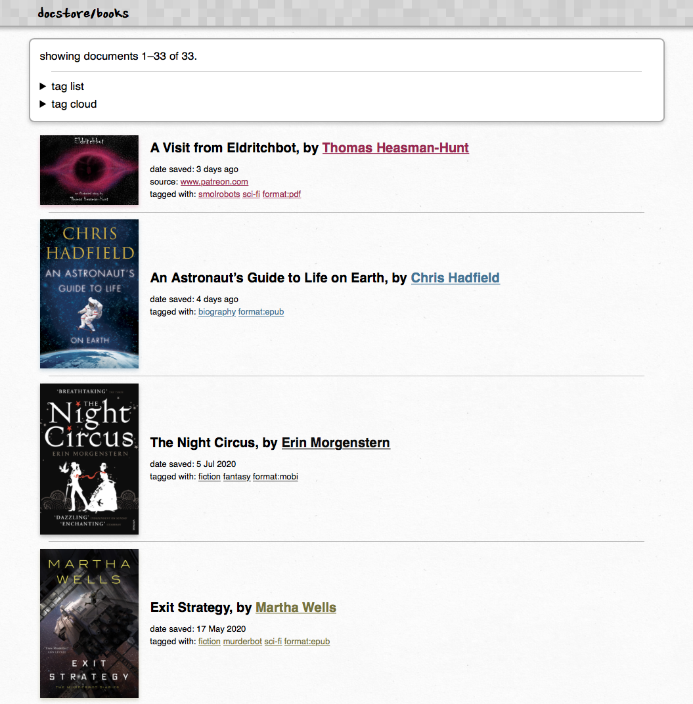

# docstore

docstore is a tool I wrote to help me manage my scanned documents and reference files.
It uses [keyword tagging](https://en.wikipedia.org/wiki/Tag_(metadata)) to categorise files, and creates thumbnails to help identify files.

It has two parts:

*   A CLI tool that lets me store new documents
*   A web app that lets me browse the documents it's already stored

Here's a screenshot of the web app:



I don't expect that anybody else will want to use docstore directly, but the ideas might be useful.
The rest of this README describes some of the motivation and design.


## Why I wrote it

*   **I prefer keyword tagging to files-and-folders as a way to organise files.**
    I'm a particular fan of how [Pinboard](https://pinboard.in/) does tagging, but I haven't found an app that stores files with Pinboard-like.

*   **I want my documents stored locally.**
    My scanned paperwork in particular contains a lot of private information -- bank statements, medical letters, rental contracts, and more.
    I don't want to upload them to a cloud service and risk them being leaked.

*   **I'm very picky about how this sort of thing.**
    I've tried a bunch of other apps and services for doing this sort of thing, but none of them were quite right.
    I found it easier to write my own tool than try to use something written by somebody else.

    It helps that my needs are quite simple -- the whole app is about a thousand lines of code, which is pretty manageable.


## Design principles

*   **Use JSON as a database.**
    All the metadata about my documents is kept in a single JSON file.
    JSON is a simple, popular format with several advantages for me:

    -   Lots of tools can read it.
        Pretty much every programming language has a JSON parser, so I'm guaranteed I'll be able to parse the metadata file for years to come.
    -   I can edit JSON in a text editor.
        This saves me building editing features into docstore -- if I've made a typo or want to change something, I can edit the metadata JSON directly.
    -   It maps directly to Python data structures (Python is what I use to write docstore).
        The serialisation and deserialisation isn't very complicated.

    If you were building an app that had to store a lot of documents or support multiple users, JSON would be a poor choice -- you'd want to use a proper database instead.
    My biggest docstore instance only has a few thousand files, and the cost of JSON parsing is negligible.

*   **A document can have multiple files.**

    This wasn't part of my original design, but I added it when I rewrote docstore in autumn 2020.
    This means that I can group files together -- for example, if I have two scans of the same original document.

    Here's an example of how a document is described in the JSON:

    ```json
    {
      "date_saved": "2020-10-03T16:30:08.471833",
      "files": [
        {
          "checksum": "sha256:fe79444e61b9c009a22497a9878020da98f557476b7f993432bc94fa700e888a",
          "date_saved": "2020-10-03T16:30:08.471833",
          "filename": "Eldritchbot.pdf",
          "id": "331e2b59-fe82-48a4-8d59-f71b0f2ad7b3",
          "path": "files/e/eldritchbot.pdf",
          "size": 2215466,
          "source_url": "https://www.patreon.com/posts/visit-from-40137342",
          "thumbnail": {
            "path": "thumbnails/E/Eldritchbot.pdf.png"
          }
        }
      ],
      "id": "9dd532c7-edf9-428a-9637-df9bb6030378",
      "tags": [
        "smolrobots",
        "sci-fi",
        "format:pdf",
        "by:Thomas Heasman-Hunt"
      ],
      "title": "A Visit from Eldritchbot"
    }
    ```

*   **Stay close to the original filename.**

    As much as possible, I want docstore to use the original filename.
    This makes the underlying storage human-readable, and it means that if I lost the metadata, the files would still be somewhat useful.

    Here's what the underlying storage looks like:

    ```
    docstore/
    └── files/
        ├── a/
        │   ├── admin-renewal-cover-letter.html
        │   ├── advice-for-patients-and-visitors.pdf
        │   └── application-paperwork.pdf
        ├── b/
        ├── c/
        └── ...
    ```

    docstore records the original filename in the metadata, and then does some normalisation before copying a file to its storage.
    The normalisation does a couple of things:

    *   Remove any special characters and spaces.
        e.g. `alex.chan › payslip › january 2015–2016.pdf` becomes `alex-chan-payslip-january-2015-2016.pdf`

    *   Lowercase the filename.
        e.g. `P60Certificate.pdf` becomes `p60certificate.pdf`

    *   De-duplicate documents with the same name by adding some random hex to the end of the name.
        e.g. if I store two documents called `statement.pdf`, one will be stored as `statement.pdf` and the other as `statement_f97b.pdf`.

    This normalisation means I don't have to worry about whether my filesystem can cope with weird characters, or if I'm storing two different files with the same name.

    These normalised filenames aren't exposed through the web app – if I'm downloading a file, docstore sets a [`Content-Disposition` header](https://developer.mozilla.org/en-US/docs/Web/HTTP/Headers/Content-Disposition) that tells my browser to download it with the original filename.


## License

MIT.
