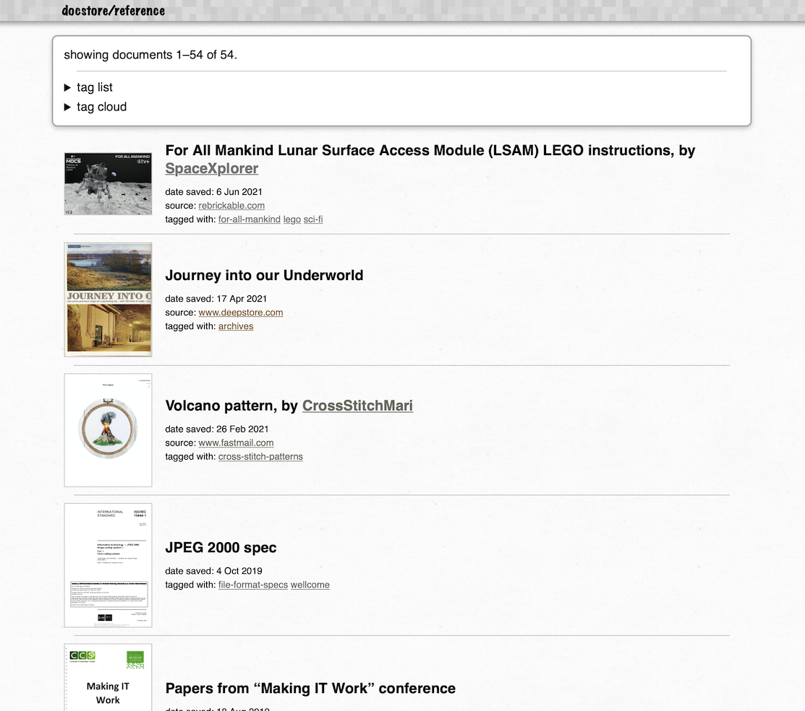
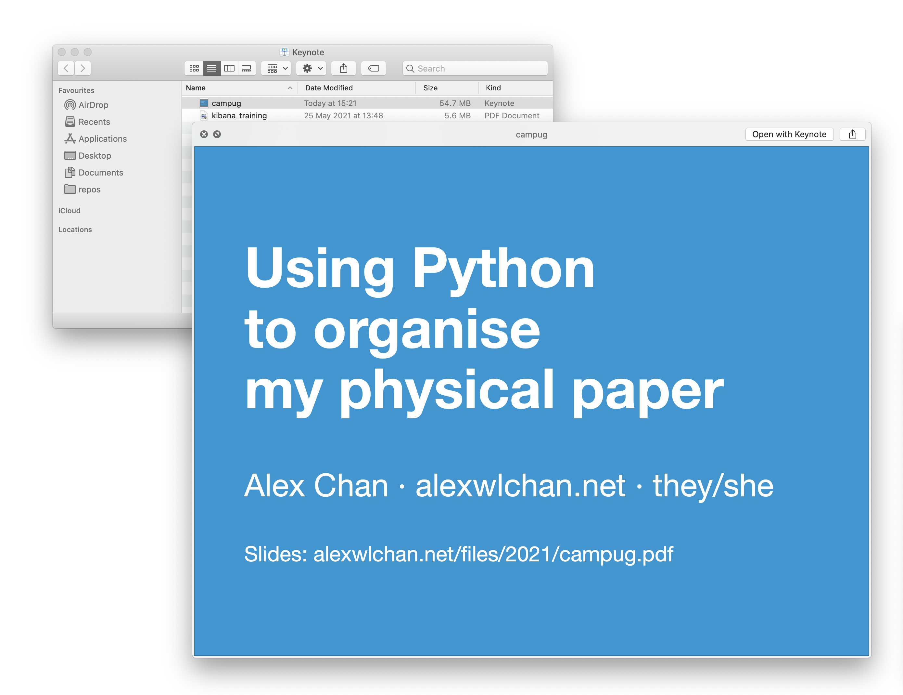

# Previewing the files

As part of the web app, I create thumbnail images for every file.
This makes it easier for me to find the file I'm looking for -- often I can spot it before I finish reading the text.



I've tried a couple of approaches for rendering file thumbnails.
You can see the current implementation in [thumbnails.py][thumbnails.py].

[thumbnails.py]: https://github.com/alexwlchan/docstore/blob/main/src/docstore/thumbnails.py


## Using pdftocairo to preview PDFs

Initially I was using [pdftocairo][pdftocairo] to render thumbnails, with a command like:

```
pdftocairo document.pdf \
  -jpeg \
  -singlefile \
  -scale-to-x 400
```

This creates a JPEG thumbnail of `document.pdf` that's 400 pixels wide.

But it occasionally had issues, especially with PDFs I'd downloaded from my bank or HR system – for example, if it was missing a font, it rendered a completely blank thumbnail.
That's not useful!

[pdftocairo]: https://www.mankier.com/1/pdftocairo


## Using Quick Look to preview arbitrary files

As I started to store more files in docstore besides scanned PDFs, I needed to write more thumbnailing rules.
For a while I tried to maintain that code myself, but I've switched to using [Quick Look][ql].
This is a file previewing tool built into macOS: when looking at a file in the Finder, you can press space to see a preview of the file:



Quick Look exposes a command-line interface for creating thumbnails:

```
qlmanage -t -s 400 document.pdf
```

This creates a PNG thumbnail of `document.pdf` that's 400 pixels wide.

By default Quick Look supports a wide variety of file types, and it's pluggable – developers can write [Quick Look generators][ql_generators] to create previews if they have a custom file format.
This means I let macOS handle the thumbnailing and don't have to worry about it in docstore.

[ql]: https://en.wikipedia.org/wiki/Quick_Look
[ql_generators]: https://developer.apple.com/design/human-interface-guidelines/macos/system-capabilities/quick-look/


## Using FFmpeg to preview animated GIFs

I have a handful of animated GIFs in docstore, and I want to get animated previews.
For this I've found the best approach is to use [FFmpeg](https://ffmpeg.org/) to create a small video file that autoplays:

```
ffmpeg -i animated.gif \
  -movflags faststart \
  -pix_fmt yuv420p \
  -vf scale=400:400
  out.mp4
```

This is the same approach Twitter use for displaying GIFs.
