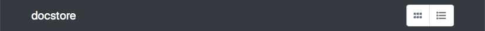
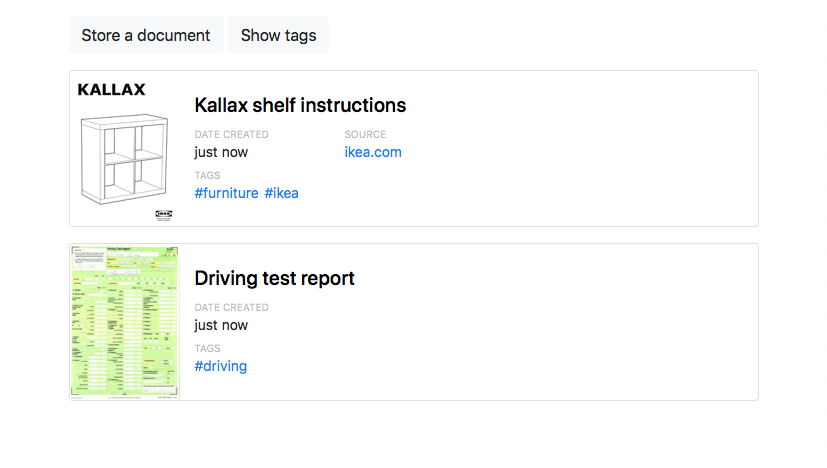
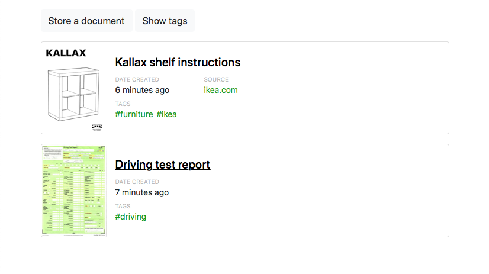

# Usage options

You can start an instance of docstore by running:

```console
$ docker run --publish 8072:8072 --volume /path/to/documents:/documents greengloves/docstore
```

This saves your data in `/path/to/documents` and makes the app available at <http://localhost:8072>.

This document explains the available options when running docstore.

## Running on a different port

If you want to run docstore on a different port, add `--env PORT=XYZ --publish XYZ:XYZ` to the `docker run` command.
For example, to run docstore on port 9000:

```
docker run \
  --env PORT=9000 \
  --publish 9000:9000 \
  --volume /path/to/documents:/documents \
  greengloves/docstore
```

## Run a specific version

If you want to run a specific version of docstore, add `:VERSION` to the name of the image in your `docker run` command.
For example, if you want to run v1.13.1, use the command:

```
docker run \
  --publish 8072:8072 \
  --volume /path/to/documents:/documents \
  greengloves/docstore:v1.13.1
```

## -&#8203;-title: Changing the title

By default, the title shown in the web app is "docstore":



You can change the title of the app by adding the `--title` option.
For example, to change the the title to `My documents`:

```
docker run \
  --publish 8072:8072 \
  --volume /path/to/documents:/documents \
  greengloves/docstore \
  --title="My documents"
```

This is what it looks like:


## -&#8203;-default_view: Selecting between table/grid view

There are two viewing modes in docstore: table view and grid view.




I prefer using the table view for text-heavy documents (e.g. my scanned PDFs), and switching to grid views for documents where the cover is a large image (e.g. ebooks).

You can switch between the two views with the toggle in the top-right of the web app.
If you want to change the default setting, add the `--default_view` option with `table` or `grid`.
For example, to use the grid view by default:

```
docker run \
  --publish 8072:8072 \
  --volume /path/to/documents:/documents \
  greengloves/docstore \
  --default_view=grid
```

## -&#8203;-accent_color: Change the tint colour in the app

By default, links and accent text are shown in a fairly generic blue.
If you want to change the colour (say, to distinguish between different instances of docstore), use the `--accent_color` option with a hex colour string.

For example, if I wanted a shade of green:

```
docker run \
  --publish 8072:8072 \
  --volume /path/to/documents:/documents \
  greengloves/docstore \
  --accent_color=#08a008
```

which looks like:



If you want help picking hex colours, I recommend [HSL Picker](http://www.hslpicker.com/#08a008).
